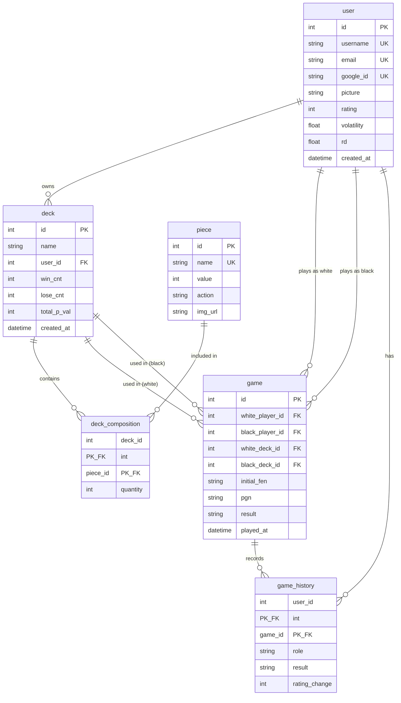
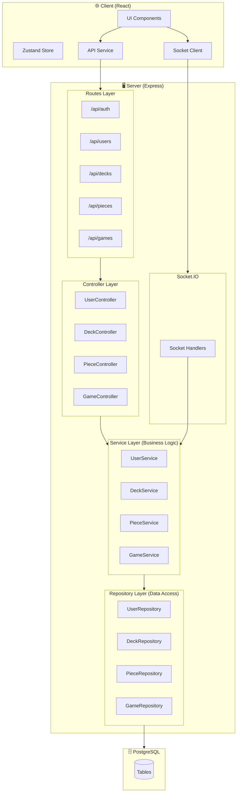
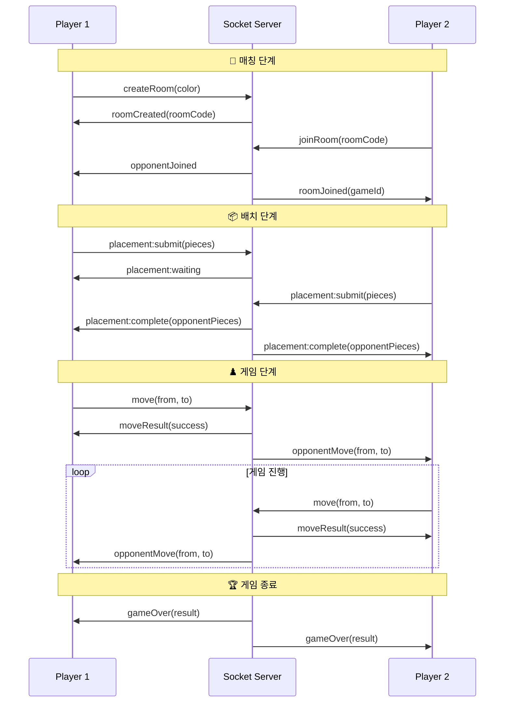
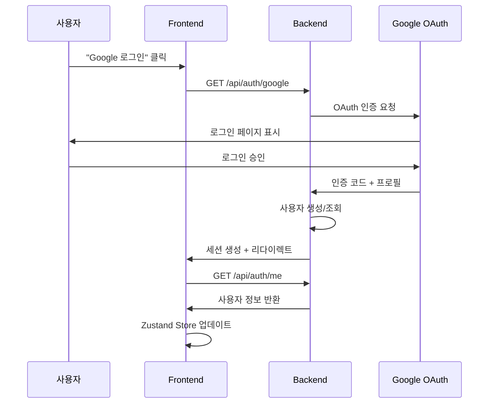
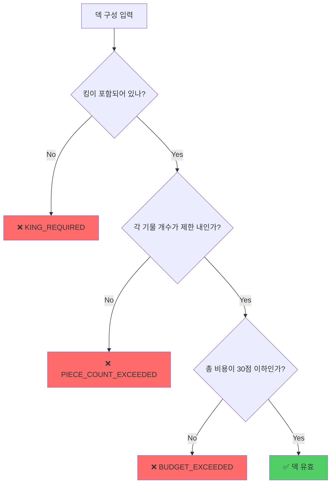
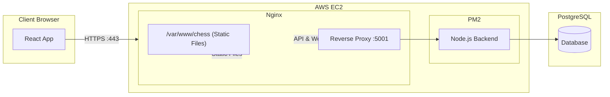

# Mad Chess - 기술 스택 및 백엔드 아키텍처

## 📚 기술 스택 (Tech Stack)

### Frontend
| 기술 | 버전 | 용도 |
|------|------|------|
| **React** | 18.2 | UI 라이브러리 |
| **TypeScript** | 5.3 | 타입 안전성 |
| **Vite** | 5.0 | 빌드 도구 & 개발 서버 |
| **React Router** | 6.21 | 클라이언트 라우팅 |
| **Tailwind CSS** | 3.4 | 스타일링 |
| **Zustand** | 4.5 | 상태 관리 (Auth Store) |
| **Axios** | 1.13 | HTTP 클라이언트 |
| **Socket.IO Client** | 4.6 | 실시간 통신 |

### Backend
| 기술 | 버전 | 용도 |
|------|------|------|
| **Node.js** | 20.x | 런타임 |
| **Express** | 4.18 | 웹 프레임워크 |
| **TypeScript** | 5.3 | 타입 안전성 |
| **Prisma** | 5.8 | ORM (데이터베이스 접근) |
| **PostgreSQL** | 15.x | 관계형 데이터베이스 |
| **Socket.IO** | 4.8 | 실시간 양방향 통신 |
| **Passport.js** | 0.7 | 인증 미들웨어 |
| **Passport Google OAuth** | 2.0 | Google 로그인 |
| **Swagger** | 6.2 | API 문서화 |

### Infrastructure
| 기술 | 용도 |
|------|------|
| **AWS EC2** | 서버 호스팅 |
| **Nginx** | 리버스 프록시 & 정적 파일 서빙 |
| **PM2** | Node.js 프로세스 관리 |
| **Let's Encrypt** | SSL 인증서 |

---

## 🗄️ 데이터베이스 스키마



---

## 🏗️ 백엔드 아키텍처

### 모듈 구조

```
backend/src/
├── server.ts              # 진입점 (Express + Socket.IO 설정)
├── config/
│   └── passport.ts        # Google OAuth 설정
├── routes/
│   └── auth.ts            # 인증 라우트
├── modules/
│   ├── user/              # 사용자 모듈
│   │   ├── user.routes.ts
│   │   ├── user.controller.ts
│   │   ├── user.service.ts
│   │   └── user.repository.ts
│   ├── deck/              # 덱 모듈
│   │   ├── deck.routes.ts
│   │   ├── deck.controller.ts
│   │   ├── deck.service.ts
│   │   └── deck.repository.ts
│   ├── piece/             # 기물 모듈
│   │   ├── piece.routes.ts
│   │   ├── piece.controller.ts
│   │   ├── piece.service.ts
│   │   └── piece.repository.ts
│   └── game/              # 게임 모듈
│       ├── game.routes.ts
│       ├── game.controller.ts
│       ├── game.service.ts
│       └── game.repository.ts
├── socket/
│   └── handlers.ts        # Socket.IO 이벤트 핸들러
└── utils/
    └── prisma.ts          # Prisma 클라이언트 인스턴스
```

### 레이어드 아키텍처



---

## 🔌 Socket.IO 이벤트 흐름

### 매칭 & 게임 플로우



### Socket 이벤트 목록

| 이벤트 | 방향 | 설명 |
|--------|------|------|
| `createRoom` | Client → Server | 새 게임 방 생성 |
| `roomCreated` | Server → Client | 방 코드 전달 |
| `joinRoom` | Client → Server | 방 참가 요청 |
| `roomJoined` | Server → Client | 참가 성공 |
| `opponentJoined` | Server → Client | 상대방 입장 알림 |
| `placement:submit` | Client → Server | 기물 배치 제출 |
| `placement:waiting` | Server → Client | 상대 배치 대기 |
| `placement:complete` | Server → Client | 양쪽 배치 완료 |
| `move` | Client → Server | 수 제출 |
| `moveResult` | Server → Client | 수 결과 |
| `opponentMove` | Server → Client | 상대방 수 알림 |
| `gameOver` | Server → Client | 게임 종료 |

---

## 🔐 인증 흐름 (Google OAuth)



---

## 📡 API 엔드포인트 요약

| 메소드 | 경로 | 설명 |
|--------|------|------|
| **Auth** |
| GET | `/api/auth/google` | Google OAuth 시작 |
| GET | `/api/auth/google/callback` | OAuth 콜백 |
| GET | `/api/auth/me` | 현재 사용자 정보 |
| POST | `/api/auth/logout` | 로그아웃 |
| **Users** |
| GET | `/api/users/:id` | 사용자 조회 |
| GET | `/api/users/:id/decks` | 사용자 덱 목록 |
| GET | `/api/users/:id/stats` | 사용자 통계 |
| **Decks** |
| POST | `/api/decks` | 덱 생성 |
| GET | `/api/decks/:id` | 덱 상세 조회 |
| PUT | `/api/decks/:id` | 덱 수정 |
| DELETE | `/api/decks/:id` | 덱 삭제 |
| POST | `/api/decks/validate` | 덱 검증 |
| **Pieces** |
| GET | `/api/pieces` | 모든 기물 조회 |
| GET | `/api/pieces/:id` | 기물 상세 조회 |
| **Games** |
| POST | `/api/games` | 게임 생성 |
| GET | `/api/games/:id` | 게임 조회 |
| PUT | `/api/games/:id` | 게임 업데이트 (결과) |

---

## 🎮 덱 검증 로직



### 기물 제한

| 기물 | 최대 개수 | 비용 (pts) |
|------|----------|-----------|
| King (k) | 1 (필수) | 0 |
| Queen (q) | 1 | 9 |
| Rook (r) | 2 | 5 |
| Bishop (b) | 2 | 3 |
| Knight (n) | 2 | 3 |
| Pawn (p) | 8 | 1 |

**총 예산: 30점**

---

## 🚀 배포 구성



---

*© 2024 Mad Chess Studio*
